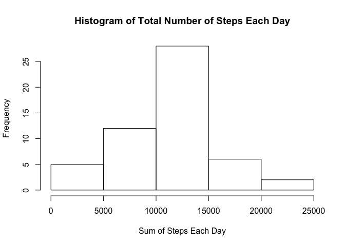
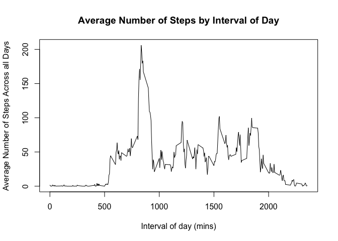
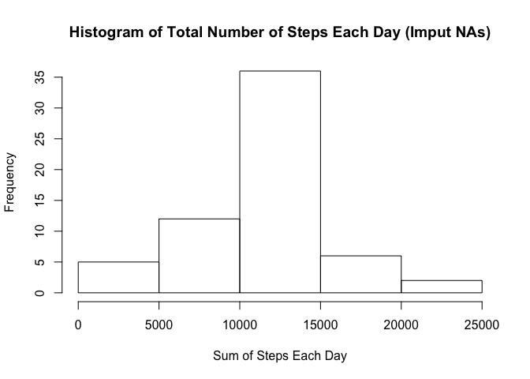
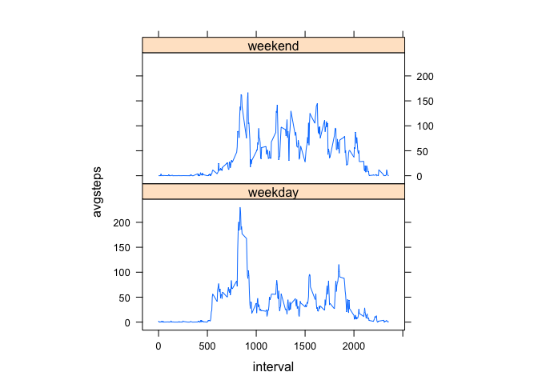

#Reproducible Research: Peer Assessment 1


```r
#set working directory
setwd("/Users/yvette/current")
```
## Loading and preprocessing the data
- Load the data (i.e. 𝚛𝚎𝚊𝚍.𝚌𝚜𝚟())
- Process/transform the data (if necessary) into a format suitable for your analysis

###1.Code for reading in the dataset and processing the data

```r
dt1<-read.csv("activity.csv")
dt1$date <- as.Date(as.factor(dt1$date))
dt2<-subset(dt1, !(is.na(dt1$steps)))
```
## What is mean total number of steps taken per day?
For this part of the assignment, you can ignore the missing values in the dataset.

- Calculate the total number of steps taken per day. 
- Make a histogram of the total number of steps taken each day. 
- Calculate and report the mean and median of the total number of steps taken per day.


```r
#Calculate the total number of steps taken per day
library(plyr)
library(httpuv)
dtsum <- ddply(dt2, .(date), summarise,  sumsteps=sum(steps, na.rm=TRUE))
```
###2.Histogram of the total number of steps taken each day

```r
hist(dtsum$sumsteps,main="Histogram of Total Number of Steps Each Day",
     xlab="Sum of Steps Each Day")
```

<!-- -->

###3.Mean and median number of steps taken each day

```r
#Calculate and report the mean and median of the total number of steps taken per day.
summedian<-median(dtsum$sumsteps)
summean<-format(round(mean(dtsum$sumsteps)),nsmall=1)
summary(dtsum)
```

```
##       date               sumsteps    
##  Min.   :2012-10-02   Min.   :   41  
##  1st Qu.:2012-10-16   1st Qu.: 8841  
##  Median :2012-10-29   Median :10765  
##  Mean   :2012-10-30   Mean   :10766  
##  3rd Qu.:2012-11-16   3rd Qu.:13294  
##  Max.   :2012-11-29   Max.   :21194
```
###Mean of steps taken each day is 10766.0. 
###Median of steps taken each day is 10765.

## What is the average daily activity pattern?
- Make a time series plot (i.e. 𝚝𝚢𝚙𝚎 = "𝚕") of the 5-minute interval (x-axis) and the average number of steps taken, averaged across all days (y-axis)
- Which 5-minute interval, on average across all the days in the dataset, contains the maximum number of steps?

```r
#the average number of steps taken, averaged across all days 
dtint<- ddply(dt2, .(interval), summarise, avgsteps=mean(steps, na.rm=TRUE))
```
###4.Time series plot of the average number of steps taken

```r
plot(dtint$interval,dtint$avgsteps,type="l",xlab="Interval of day (mins)",
     ylab="Average Number of Steps Across all Days", 
     main="Average Number of Steps by Interval of Day")
```

<!-- -->

###5.The 5-minute interval that, on average, contains the maximum number of steps

```r
dtmax<-subset(dtint,dtint$avgsteps==max(dtint$avgsteps))
minterval<-dtmax$interval
msteps<-format(round(dtmax$avgsteps),nsmall=1)
dtmax
```

```
##     interval avgsteps
## 104      835 206.1698
```
###Interval #835 has maximum average of 206.0 steps.


## Imputing missing values
Note that there are a number of days/intervals where there are missing values (coded as 𝙽𝙰). The presence of missing days may introduce bias into some calculations or summaries of the data.

- Calculate and report the total number of missing values in the dataset (i.e. the total number of rows with 𝙽𝙰s)
- Devise a strategy for filling in all of the missing values in the dataset. The strategy does not need to be sophisticated. For example, you could use the mean/median for that day, or the mean for that 5-minute interval, etc.
- Create a new dataset that is equal to the original dataset but with the missing data filled in.
- Make a histogram of the total number of steps taken each day and Calculate and report the mean and median total number of steps taken per day. Do these values differ from the estimates from the first part of the assignment? What is the impact of imputing missing data on the estimates of the total daily number of steps?

###6.Code to describe and show a strategy for imputing missing data

```r
missing<-sum(is.na(dt1$steps))
missing
```

```
## [1] 2304
```
###Total number of rows with NAs = 2304
###I will fill in all the NAs with the mean of the steps of the same 5-min interval across all the days.


```r
# average number of steps taken each interval across all days then replace NA with avg
dtint2<- ddply(dt1, .(interval), summarise, avgsteps=mean(steps, na.rm=TRUE))
dt3 <- merge(dt1, dtint2, by=c("interval"))
for(i in 1:nrow(dt3)) {
    if (is.na(dt3$steps[i])){
    dt3$steps[i]<-dt3$avgsteps[i]
    }
}
dt3$avgsteps<-NULL
```
###Original Dataset

```r
head(dt1)
```

```
##   steps       date interval
## 1    NA 2012-10-01        0
## 2    NA 2012-10-01        5
## 3    NA 2012-10-01       10
## 4    NA 2012-10-01       15
## 5    NA 2012-10-01       20
## 6    NA 2012-10-01       25
```
###A new dataset that is equal to the original dataset but with the missing data filled in.

```r
dt3<-dt3[with(dt3, order(dt3$date, dt3$interval)),]
head(dt3)
```

```
##     interval     steps       date
## 1          0 1.7169811 2012-10-01
## 63         5 0.3396226 2012-10-01
## 128       10 0.1320755 2012-10-01
## 205       15 0.1509434 2012-10-01
## 264       20 0.0754717 2012-10-01
## 327       25 2.0943396 2012-10-01
```
###7.Histogram of the total number of steps taken each day after missing values are imputed

```r
dtsum3 <- ddply(dt3, .(date), summarise,  sumsteps=sum(steps, na.rm=TRUE))
hist(dtsum3$sumsteps,main="Histogram of Total Number of Steps Each Day (Imput NAs)",
     xlab="Sum of Steps Each Day")
```

<!-- -->


```r
summedian3<-format(round(median(dtsum3$sumsteps)),nsmall=1)
summean3<-format(round(mean(dtsum3$sumsteps)),nsmall=1)

summary(dtsum3)
```

```
##       date               sumsteps    
##  Min.   :2012-10-01   Min.   :   41  
##  1st Qu.:2012-10-16   1st Qu.: 9819  
##  Median :2012-10-31   Median :10766  
##  Mean   :2012-10-31   Mean   :10766  
##  3rd Qu.:2012-11-15   3rd Qu.:12811  
##  Max.   :2012-11-30   Max.   :21194
```
###Mean of steps taken each day is 10766.0. 
###Median number of steps taken each day is 10766.0.
###The mean of total steps taken each day is the same between datasets with NA and NA replaced, but the median increases after NAs are replaced with average steps of each interval.
## Are there differences in activity patterns between weekdays and weekends?
For this part the 𝚠𝚎𝚎𝚔𝚍𝚊𝚢𝚜() function may be of some help here. Use the dataset with the filled-in missing values for this part.

- Create a new factor variable in the dataset with two levels – “weekday” and “weekend” indicating whether a given date is a weekday or weekend day.
- Make a panel plot containing a time series plot (i.e. 𝚝𝚢𝚙𝚎 = "𝚕") of the 5-minute interval (x-axis) and the average number of steps taken, averaged across all weekday days or weekend days (y-axis). See the README file in the GitHub repository to see an example of what this plot should look like using simulated data.
###8.Panel plot comparing the average number of steps taken per 5-minute interval across weekdays and weekends

```r
dt4<-dt3
dt4$day<- weekdays(as.Date(dt4$date))
dt4$level<-ifelse(dt4$day=="Saturday"|dt4$day=="Sunday" ,"weekend","weekday")
```


```r
library(lattice)
dtint4<- ddply(dt4, .(interval, level), summarise, avgsteps=mean(steps, na.rm=TRUE)) 
xyplot(avgsteps ~ interval | factor(level), data=dtint4 , aspect =1/2, type="l")
```

<!-- -->

